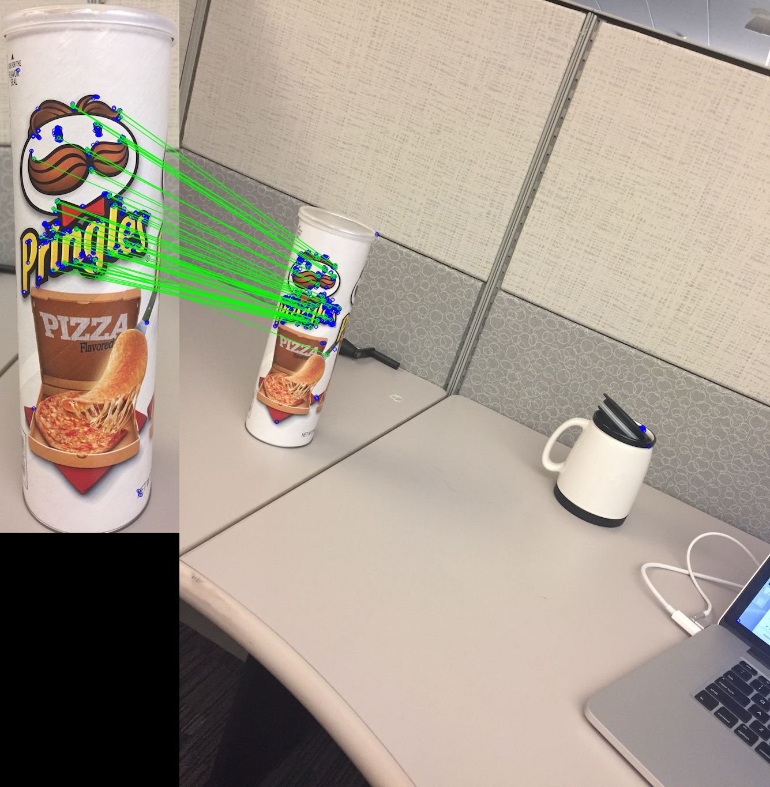

# Feature Detection/Descriptor with OpenCV
This project aims to facilitate the use of feature detector/descriptor in OpenCV from Python code. You can try and visualize different combinations of detector vs. descriptor.



## Installation on Mac OS
The instruction below was summarized from [Adrian's website](http://www.pyimagesearch.com/2015/06/15/install-opencv-3-0-and-python-2-7-on-osx/). He did a very great job explaining every necessary steps. He also had installation guide for Ubuntu users too!

1. Requires Python 2.7, Git
2. Install Python packages
  ```
pip install -r requirement.txt
  ```
  
3. Install necesssary packages
  ```
brew install cmake pkg-config jpeg libpng libtiff openexr eigen tbb
  ```
  
4. Clone OpenCV repos
  * opencv
 ```
git clone https://github.com/Itseez/opencv.git
cd opencv
git checkout 3.0.0
 ```
   * opencv_contrib
   ```
cd ..
git clone https://github.com/Itseez/opencv_contrib
cd opencv_contrib
git checkout 3.0.0
   ```
   
5. Build and install OpenCV
  ```
cd ../opencv
mkdir build
cd build
cmake -D CMAKE_BUILD_TYPE=RELEASE -D CMAKE_INSTALL_PREFIX=/usr/local \
	-D PYTHON2_PACKAGES_PATH=~/feature/lib/python2.7/site-packages \
	-D PYTHON2_LIBRARY=/usr/bin/python \
	-D PYTHON2_INCLUDE_DIR=/System/Library/Frameworks/Python.framework/Headers \
	-D INSTALL_C_EXAMPLES=ON -D INSTALL_PYTHON_EXAMPLES=ON \
	-D BUILD_EXAMPLES=ON \
	-D OPENCV_EXTRA_MODULES_PATH=~/opencv_contrib/modules ..
make -j4
make install
  ```
  
6. Verify in python shell
  ```python
>>> import cv2
>>> cv2.__version__
'3.0.0'
  ```

## Usage

To show all available options:
```
python feature.py -h
```

An example:

```
python feature.py  -t  <1: detect feature, 2: matching features with those from another image> \
		   -k  <detector technique: 1 -> 9> \
		   -d  <descriptor technique: 1-> 11> \
		   -i1 <path to image 1> \
		   -i2 <path to image 2 (only neeeded for matching)> \
		   -o  <path to output image>
```
